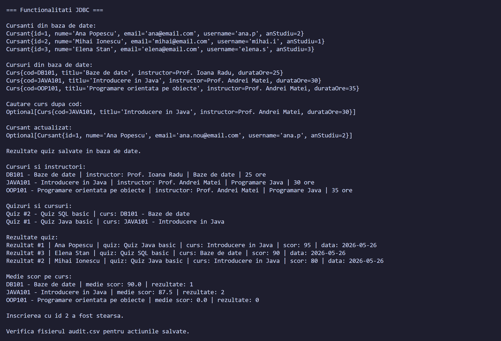
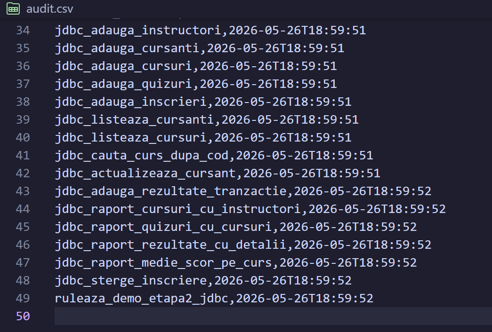

# Platforma e-learning

## Descriere

Proiectul reprezinta o platforma e-learning simpla, dezvoltata in Java. Aplicatia permite gestionarea cursurilor, utilizatorilor, cursantilor, instructorilor, lectiilor, quiz-urilor si rezultatelor obtinute de cursanti.

Aplicatia ruleaza in consola si foloseste un meniu interactiv. Utilizatorul poate afisa cursuri, poate cauta un curs dupa cod, poate inscrie cursanti la cursuri, poate adauga lectii sau rezultate la quiz-uri si poate sterge anumite date din sistem.

In prima etapa, datele sunt gestionate in memorie, folosind servicii si colectii Java. In a doua etapa, proiectul a fost extins cu persistenta in baza de date folosind JDBC si SQLite.

## Actiuni disponibile in sistem

- Afisarea tuturor cursantilor
- Afisarea tuturor instructorilor
- Afisarea tuturor cursurilor disponibile
- Afisarea cursurilor sortate dupa titlu
- Cautarea unui curs dupa cod
- Inscrierea unui cursant la un curs
- Afisarea cursantilor inscrisi la un anumit curs
- Afisarea lectiilor unui curs
- Afisarea quiz-urilor unui curs
- Afisarea rezultatelor unui cursant
- Afisarea clasamentului pentru un quiz
- Adaugarea unui cursant nou
- Adaugarea unui curs nou
- Adaugarea unei lectii la un curs
- Adaugarea unui rezultat pentru un cursant la un quiz
- Stergerea unui cursant dupa id
- Stergerea unui curs dupa cod
- Stergerea unui instructor dupa id
- Rularea demonstratiei JDBC pentru etapa a doua

## Obiecte principale

- Persoana
- User
- Cursant
- Instructor
- Curs
- Lectie
- Quiz
- Intrebare
- Inscriere
- RezultatQuiz
- CodCurs

## Functionalitati implementate in prima etapa

In prima etapa am implementat partea de modelare OOP a aplicatiei.

Aplicatia foloseste clase pentru entitatile principale din platforma e-learning: cursanti, instructori, cursuri, lectii, quiz-uri, intrebari si rezultate.

Exista o ierarhie de mostenire pentru utilizatori:

```text
Persoana -> User -> Cursant
Persoana -> User -> Instructor
```

Clasele folosesc atribute private sau protected, constructori, getteri, setteri si metode `toString`. Pentru unele clase sunt suprascrise si metodele `equals` si `hashCode`.

Clasa `CodCurs` este imutabila si este folosita pentru identificarea cursurilor.

Pentru organizarea datelor sunt folosite mai multe tipuri de colectii, precum `List`, `Set`, `Map` si `TreeSet`. Cursurile pot fi sortate dupa titlu, iar cautarea dupa cod sau dupa id se face rapid folosind map-uri.

Aplicatia foloseste si exceptii custom pentru cazurile in care un curs sau un utilizator nu este gasit.

## Functionalitati implementate in a doua etapa

In a doua etapa am adaugat persistenta datelor folosind JDBC.

Datele sunt salvate intr-o baza de date SQLite. Configurarea conexiunii se face prin fisierul `db.properties`, iar tabelele sunt definite in `schema.sql`.

Baza de date contine tabele pentru:

- instructori
- cursanti
- cursuri
- quiz-uri
- inscrieri
- rezultate la quiz-uri

Tabelele au chei primare si relatii prin foreign key. De exemplu, un curs are un instructor, un quiz apartine unui curs, iar un rezultat la quiz apartine unui cursant si unui quiz.

## Repository-uri

Pentru lucrul cu baza de date am adaugat o interfata generica `Repository<T, ID>`, care contine operatiile de baza:

- `save`
- `findById`
- `findAll`
- `update`
- `delete`

Am implementat repository-uri concrete pentru entitatile principale:

- `CursantRepository`
- `InstructorRepository`
- `CursRepository`
- `InscriereRepository`
- `QuizRepository`

Toate interogarile SQL folosesc `PreparedStatement`, iar resursele sunt inchise cu `try-with-resources`.

## Tranzactie JDBC

Pentru cerinta de tranzactie am implementat o operatie de salvare a rezultatelor la quiz.

Metoda `adaugaRezultatCuTranzactie` verifica daca exista cursantul si quiz-ul, apoi insereaza rezultatul in baza de date si actualizeaza numarul de rezultate pentru quiz.

Operatia este facuta intr-o tranzactie JDBC explicita. Daca toate operatiile reusesc, se face `commit`. Daca apare o eroare, se face `rollback`.

## Interogari cu JOIN

Am adaugat mai multe rapoarte care folosesc `JOIN` intre tabele:

- afisarea cursurilor impreuna cu instructorii lor
- afisarea quiz-urilor impreuna cu numele cursurilor
- afisarea rezultatelor la quiz impreuna cu date despre cursant, quiz si curs
- calcularea mediei scorurilor pentru fiecare curs

Aceste interogari sunt implementate in serviciul `ElearningJdbcService`.

## Audit

Aplicatia are si un serviciu de audit, implementat in clasa `AuditService`.

Acesta salveaza actiunile executate in fisierul `audit.csv`, impreuna cu momentul la care au fost rulate.

Fisierul este deschis in mod append, astfel incat actiunile noi se adauga la final si nu suprascriu continutul existent. Scrierea in fisier este thread-safe.

## Rulare

Aplicatia se ruleaza din consola. La pornire se afiseaza meniul principal cu actiunile disponibile.

Pentru functionalitatile din etapa a doua se foloseste optiunea:

```text
19. Ruleaza demo Etapa II JDBC
```

Aceasta optiune initializeaza baza de date, insereaza date de test, afiseaza datele salvate, testeaza operatii CRUD, ruleaza tranzactia pentru rezultate la quiz, afiseaza rapoartele cu JOIN si scrie actiunile in `audit.csv`.

## Capturi de ecran

### Demo JDBC

In captura de mai jos se vede rularea optiunii 19, unde sunt testate operatiile JDBC, tranzactia si interogarile cu JOIN.



### Audit CSV

In captura de mai jos se vede fisierul `audit.csv`, unde sunt salvate actiunile executate impreuna cu timestamp-ul.



## Observatii

La pornire, aplicatia initializeaza cateva date de test in memorie, pentru meniul interactiv din prima etapa.

Pentru partea JDBC, datele sunt salvate separat in baza de date SQLite. Baza de date poate fi recreata folosind fisierul `schema.sql`.

Fisierul `audit.csv` poate fi verificat dupa rulare pentru a vedea actiunile executate.